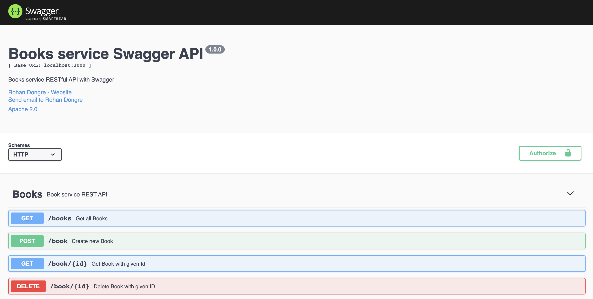
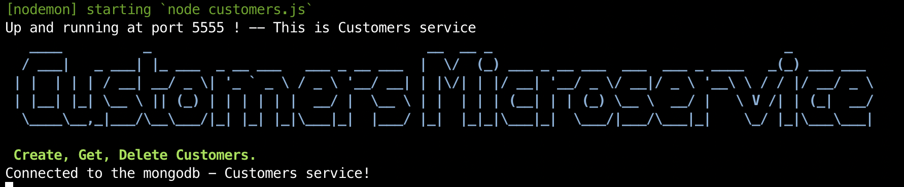
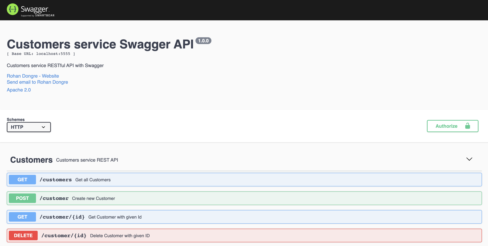
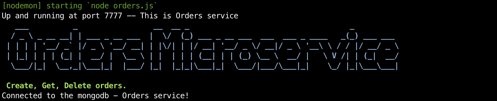
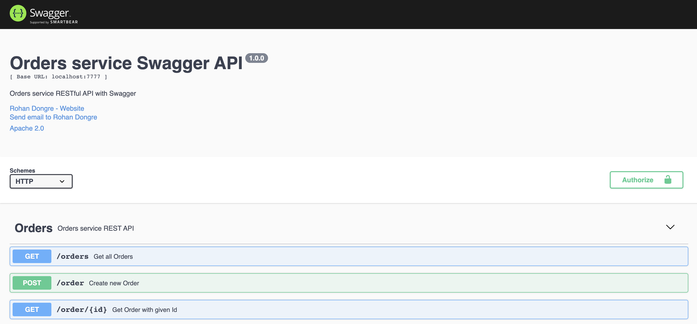

# library-app
This is Library app with REST API's developed in NodeJs, Express, MongoDB.

### Books REST API


Please free to modify the server port. The current state uses 3000 as server port.

Please use below URL's to browse Book

* **Create Book**
    - http://localhost:3000/book
    ```
    curl -X POST "http://localhost:3000/book" -H "accept: application/json" -H "Content-Type: application/json" -d "{ \"title\": \"Java from scratch\", \"author\": \"Java\", \"numberPages\": 364, \"publisher\": \"Oracle\"}"
    ```
* **Get Books**
    - http://localhost:3000/books
    ```
    curl -X GET "http://localhost:3000/books" -H "accept: application/json"
    ```
* **Get Book by ID**
    - http://localhost:3000/book/5e64261290ca145e048ce980
    ```
    curl -X GET "http://localhost:3000/book/5e64261290ca145e048ce980" -H "accept: application/json"
    ```
* **Delete Book by ID**
    - http://localhost:3000/book/5e64261290ca145e048ce980
    ```
    curl -X DELETE "http://localhost:3000/book/5e64261290ca145e048ce980" -H "accept: application/json"
    ```
* **Swagger UI**
    - http://localhost:3000/api-docs/books/


### Customers REST API

Please free to modify the server port. The current state uses 5555 as server port.

Please use below URL's to browse Customer

* **Create Customers**
    - http://localhost:5555/customer
    ```
    curl -X POST "http://localhost:5555/customer" -H "accept: application/json" -H "Content-Type: application/json" -d "{ \"name\": \"Sai\", \"age\": 27, \"address\": \"Detroit\"}"
    ```
* **Get Customers**
    - http://localhost:5555/customers
    ```
    curl -X GET "http://localhost:5555/customers" -H "accept: application/json"
    ```
* **Get Customer by ID**
    - http://localhost:5555/customer/5e642d0d6d0382618578e1f3
    ```
    curl -X GET "http://localhost:5555/customer/5e642d0d6d0382618578e1f3" -H "accept: application/json"
    ```
* **Delete Customer by ID**
    - http://localhost:5555/customer/5e642d0d6d0382618578e1f3
    ```
    curl -X DELETE "http://localhost:5555/customer/5e642d0d6d0382618578e1f3" -H "accept: application/json"
    ```
* **Swagger UI**
    - http://localhost:5555/api-docs/customers/


### Orders REST API

Please free to modify the server port. The current state uses 5555 as server port.

Please use below URL's to browse Customer

* **Create CustoOrdersmers**
    - http://localhost:7777/order
    ```
    curl -X POST "http://localhost:7777/order" -H "accept: application/json" -H "Content-Type: application/json" -d "{ \"customerID\": \"5e6197f8d5d1561dc75cc214\", \"bookID\": \"5e607b0a22674f1579dc4ffb\", \"initialDate\": \"2020-03-01\", \"deliveryDate\": \"2020-03-10\"}"
    ```
* **Get Orders**
    - http://localhost:7777/orders
    ```
    curl -X GET "http://localhost:7777/orders" -H "accept: application/json"
    ```
* **Get Order by ID**
    - http://localhost:7777/order/5e63eb9f90bfc34a8f98d1c6
    ```
    curl -X GET "http://localhost:7777/order/5e63eb9f90bfc34a8f98d1c6" -H "accept: application/json"
    ```
* **Swagger UI**
    - http://localhost:7777/api-docs/orders/


- **To install npm packages**
```
npm install --save express
npm install --save body-parser
npm install --save mongoose
npm install -g nodemon
npm install --save node-banner
npm install --save request
npm install --save swagger-ui-express
```
- **To Start app:**
```
nodemon books.js
nodemon customers.js
nodemon orders.js
```